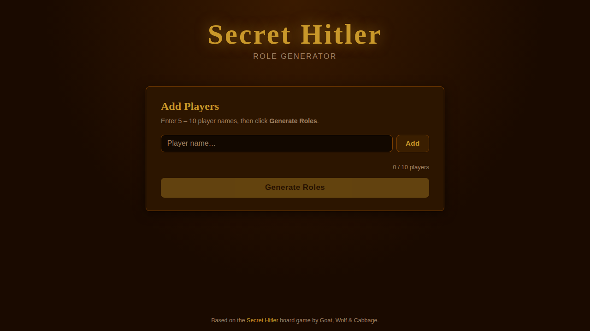
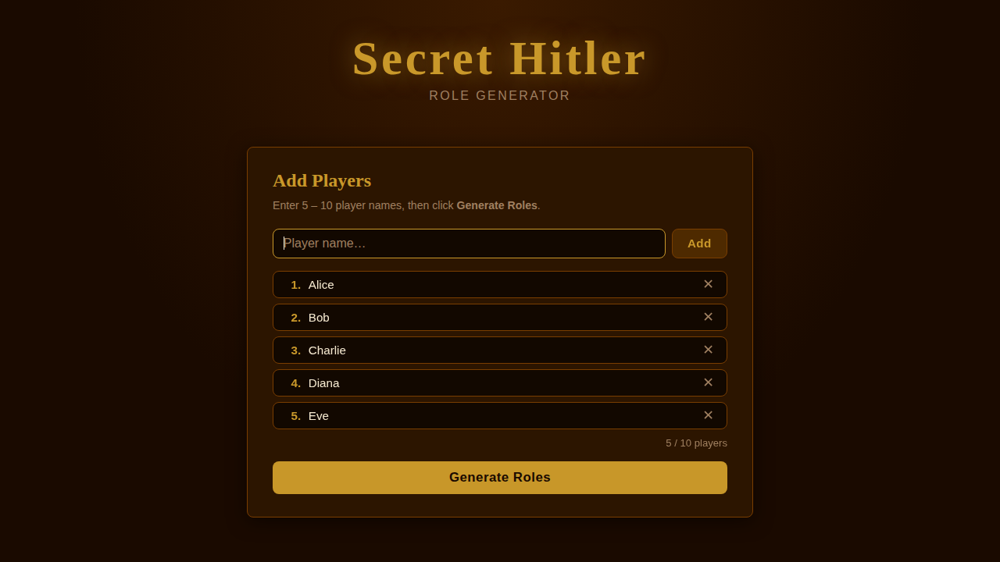
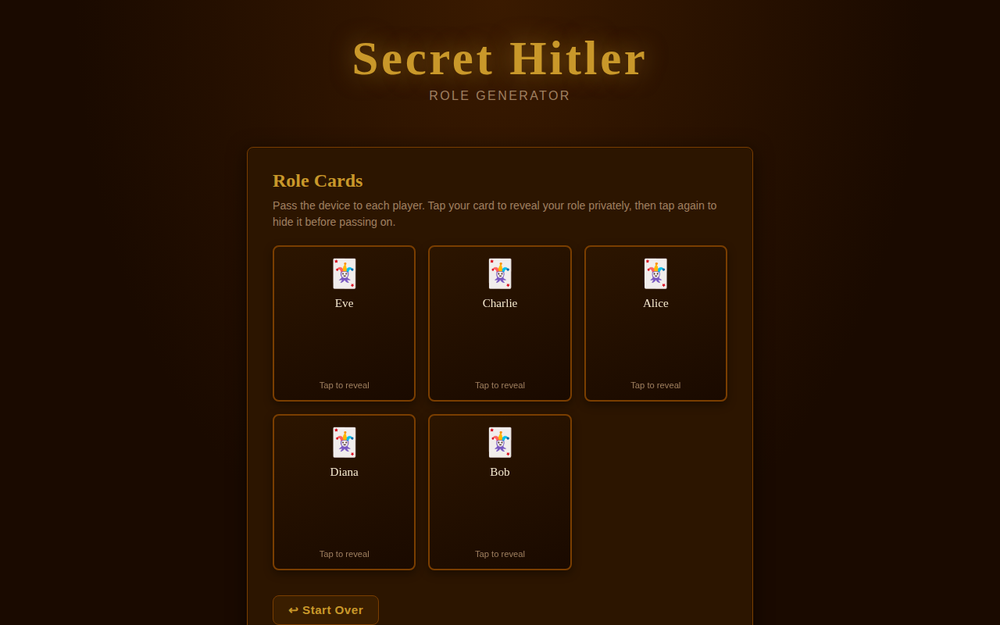
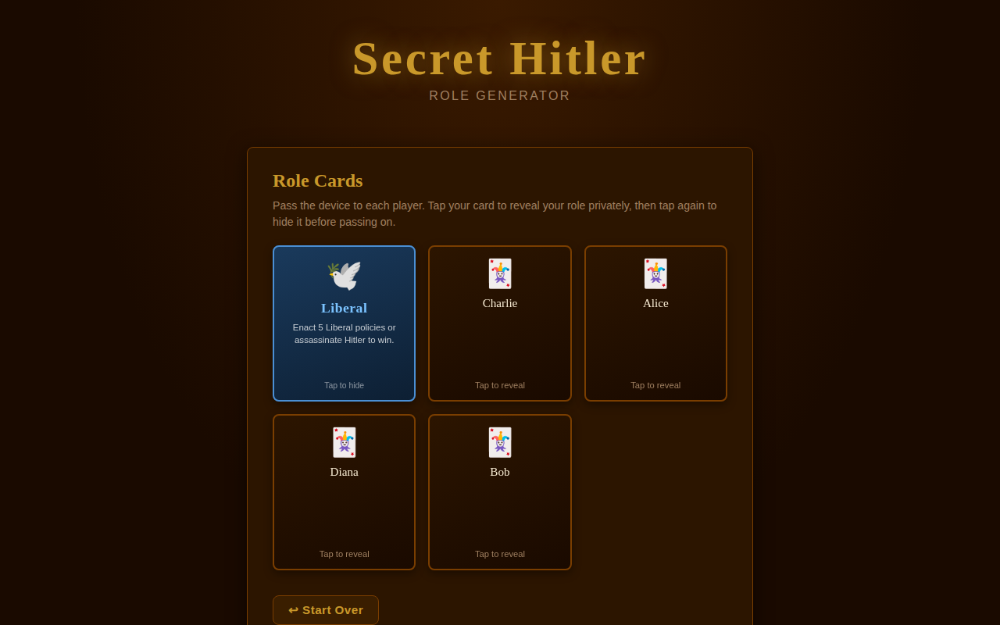

# Secret Hitler – Role Generator

[](https://github.com/nadavWeisler/SecretHitlerGenerator/actions/workflows/ci.yml)

A lightweight, single-page web app that randomly assigns secret roles to players for a custom game of [Secret Hitler](https://www.secrethitler.com/). No installation, no server, no build step – just open `index.html` in any modern browser and play.

---

## Table of Contents

- [Screenshots](#screenshots)
- [Features](#features)
- [How It Works](#how-it-works)
- [Role Distribution](#role-distribution)
- [Quick Start](#quick-start)
- [Project Files](#project-files)
- [Development](#development)
- [License](#license)

---

## Screenshots

**Step 1 – Add players**



**Step 2 – Enter player names (5–10)**



**Step 3 – Role cards (face-down)**



**Step 4 – Tap a card to reveal the secret role**



---

## Features

- 🎴 **Flip-card reveal** – each card starts face-down; tap to reveal privately, tap again to hide
- 👥 **5–10 players** supported, matching the official Secret Hitler player counts
- 🎲 **Fair shuffle** – roles distributed with Fisher-Yates shuffle on every generation
- 🔒 **Private reveal** – pass the device; roles are never shown to bystanders
- ⚡ **Zero dependencies** – pure HTML, CSS, and vanilla JavaScript; no install required
- 📱 **Mobile-friendly** – responsive layout works on phones and tablets

---

## How It Works

1. **Add players** – type each player's name and press **Add** (or Enter). Names appear in a numbered list and can be removed before generating.
2. **Generate Roles** – once 5–10 players are listed the **Generate Roles** button activates. Click it to shuffle and assign roles.
3. **Private reveal** – the app switches to a grid of face-down role cards, one per player. Pass the device around; each player taps their own card to see their role, reads it, then taps again to hide it before handing back.
4. **Start Over** – the **↩ Start Over** button resets everything so you can re-run for the next game.

---

## Role Distribution

Roles are assigned according to the official Secret Hitler rules:

| Players | Liberals | Fascists | Hitler |
|:-------:|:--------:|:--------:|:------:|
| 5       | 3        | 1        | 1      |
| 6       | 4        | 1        | 1      |
| 7       | 4        | 2        | 1      |
| 8       | 5        | 2        | 1      |
| 9       | 5        | 3        | 1      |
| 10      | 6        | 3        | 1      |

Each role card shows the role name, an icon, and a brief reminder of the win condition.

---

## Quick Start

```bash
# Clone the repository
git clone https://github.com/nadavWeisler/SecretHitlerGenerator.git

# Open the app – no build step needed
open SecretHitlerGenerator/index.html   # macOS
xdg-open SecretHitlerGenerator/index.html  # Linux
# On Windows: double-click index.html in Explorer
```

Or simply [download the ZIP](https://github.com/nadavWeisler/SecretHitlerGenerator/archive/refs/heads/main.zip), extract it, and open `index.html`.

---

## Project Files

| File / Folder          | Description                                       |
|------------------------|---------------------------------------------------|
| `index.html`           | App shell and markup                              |
| `style.css`            | Dark, themed styles with responsive layout        |
| `lib.js`               | Pure game logic (constants, shuffle, role builder)|
| `script.js`            | DOM interaction layer                             |
| `tests/lib.test.js`    | Jest unit tests for game logic                    |
| `docs/images/`         | Screenshots used in this README                   |
| `.github/workflows/`   | GitHub Actions CI configuration                   |

---

## Development

### Running tests

Pure game-logic is covered by [Jest](https://jestjs.io/) unit tests with 100 % coverage:

```bash
npm install   # install dev-dependencies (Jest)
npm test      # run all tests with coverage report
```

### CI / CD

A GitHub Actions workflow (`.github/workflows/ci.yml`) runs automatically on every push and pull-request:

1. Checks out the code
2. Installs Node.js 20 and dependencies via `npm ci`
3. Runs `npm test` (Jest with coverage)

---

## License

Secret Hitler the board game is published under a [Creative Commons BY–NC–SA 4.0](https://creativecommons.org/licenses/by-nc-sa/4.0/) license by Goat, Wolf &amp; Cabbage. This fan-made role generator is an independent tool and is not affiliated with or endorsed by the original creators.
